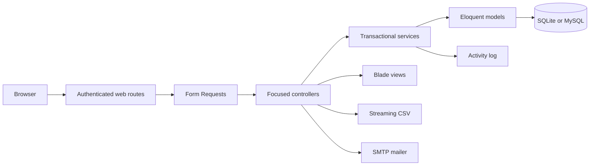
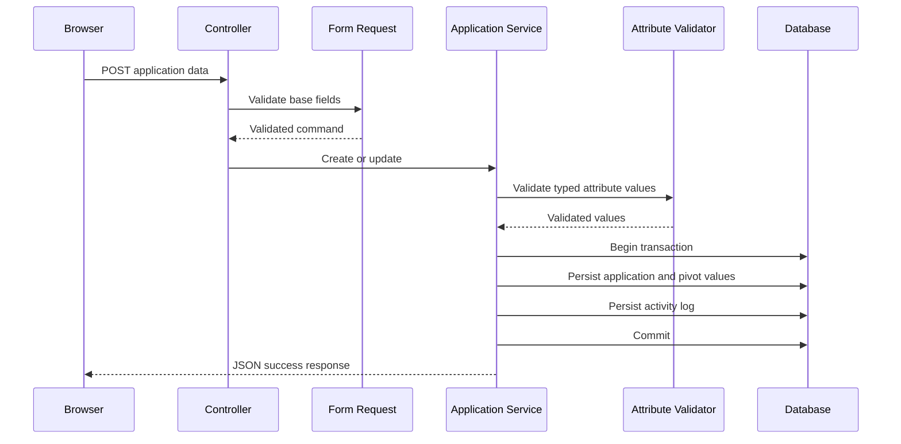

# Architecture

SiMonika is a modular monolith. One Laravel application owns the HTTP interface, server rendered views, domain workflows, and relational persistence. This structure fits the current operational scope and avoids distributed system costs that the project does not need.

## Responsibilities

- `routes/web.php` maps the browser interface and applies authentication, throttling, and role checks.
- `app/Http/Requests` validates commands before a workflow starts.
- `app/Http/Controllers` translates HTTP requests and responses.
- `app/Services` owns transactions that span models, pivot data, and activity logs.
- `app/Models` defines persistence, relationships, casts, and domain constants.
- `app/Support` contains narrow infrastructure helpers such as CSV streaming.
- `resources/views` renders the interface; page JavaScript is split by interaction responsibility.
- `database/migrations` is the schema history and supports clean migration and rollback.
- `tests/Feature` verifies user visible behavior against an isolated database.

## Application and attribute write flow

Validation completes before the transaction mutates data. The application row, dynamic attribute values, and activity record either succeed together or roll back together.

## Authorization

Every operational route requires an authenticated session. Administrator management and activity log export additionally require the `super_admin` role. Authorization is enforced by middleware on the server; navigation visibility is only a presentation concern.

## Deployment shape

The local workflow runs Laravel's development server with SQLite. Docker uses Apache and persists SQLite under `storage/docker`. A deployed instance can use MySQL and SMTP through environment variables without changing application code.

## Current scale boundary

Application and attribute screens load their inventory for client side filtering. This keeps the current UI responsive for a small operational catalogue. Larger datasets should move search, filters, and pagination into database queries before claiming scale beyond that boundary.
