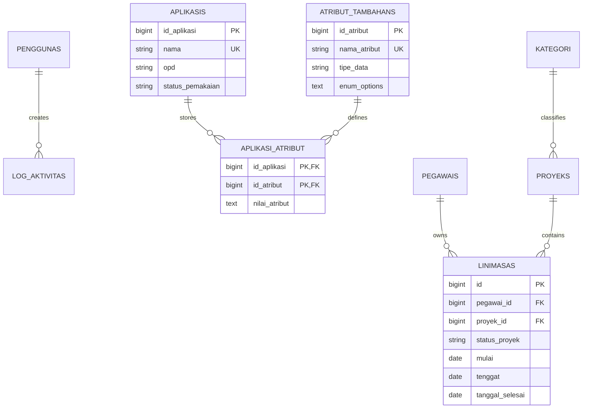

# Data model

## Dynamic attributes

An attribute is a global definition with one of five types: short text, long text, number, date, or enum. The composite primary key on `aplikasi_atribut` prevents duplicate values for the same application and definition. Both foreign keys cascade on deletion.

Changing an attribute definition is rejected when existing values would become invalid under the new type or enum options. This prevents a metadata edit from silently corrupting stored values.

## Timeline integrity

Every timeline entry references one employee and one project. Deleting either parent cascades its timeline entries. A project may reference a category; category deletion is blocked by the application while projects still use it.

Completed statuses require a completion date. The status is validated against the deadline: earlier, on time, or late. Active statuses reject a completion date.

Activity logs keep a nullable actor reference. Deleting an administrator sets that reference to null so historical audit evidence remains available.

## Migration history

The early prototype created singular table variants. A cleanup migration removes those orphaned tables while preserving the repository's development history. Clean installation and full rollback are both verified on an isolated SQLite database.

No production data is committed. Optional demo data is generated only when explicitly enabled through environment configuration.
