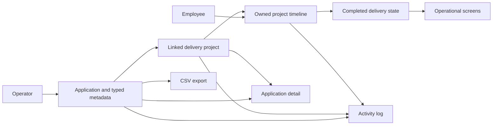

# End-to-end product flow

Phase 4 connects the application inventory to delivery operations without changing SiMonika's modular monolith architecture.

## Validated scenario

The automated product test creates a typed metadata definition, an application and its value, a category, an employee, and a project linked to that application. It starts and completes a timeline with a date-consistent status, records an internship period, and updates the operator profile.

The test then verifies the dashboard, project list, timeline, internship screen, application JSON detail, CSV export, and audit modules. Separate failure tests reject a nonexistent application reference and prove that deleting an application preserves its project while clearing the optional link.

## Local reproduction

The demo seeder creates only synthetic records. Its `Modernisasi Portal` project links to `Portal Layanan`, so a reviewer can inspect the same integration from both the project list and the application detail modal after following the README setup steps.
