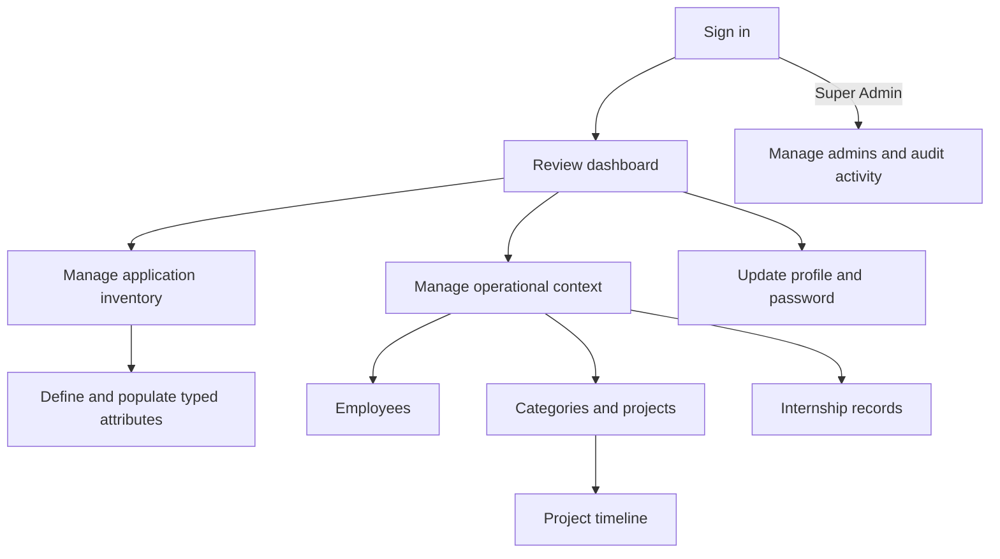

# Product scope

## Product definition

SiMonika is an internal web product for maintaining an application inventory and the operational context around it. It replaces disconnected spreadsheets with a single authenticated workspace for application metadata, responsible employees, projects, delivery timelines, and internship records.

The portfolio edition uses synthetic data and contains no government records, internal infrastructure addresses, or production credentials.

## Users

### Admin

An admin performs daily operational work:

- review application status on the dashboard;
- create, inspect, update, filter, and export applications;
- define typed metadata that applies consistently to every application;
- maintain employees, project categories, projects, and delivery timelines;
- maintain university internship periods and participant counts;
- update their own name and password.

### Super Admin

A super admin can perform every admin workflow and also:

- create, update, and remove admin accounts;
- review application and administrator summaries;
- review and export the activity log.

## Core user flows

## Product boundaries

- The product runs locally through PHP or Docker and is evaluated through a browser.
- SQLite is the reproducible local database. MySQL remains configurable for a future hosted environment.
- Email delivery uses the configured Laravel mailer. Local evaluation can use the log or array mailer.
- Application filtering is designed for a small operational catalogue. The interface does not claim large-scale inventory performance.
- SiMonika does not monitor server uptime or collect live telemetry from registered applications.
- The project does not contain real organizational data.

## Definition of done for the local web product

SiMonika is complete for this portfolio phase when:

1. A clean installation can be initialized from documented commands.
2. Admin and super-admin sessions reach only authorized screens.
3. Every core record can be created, viewed, updated, and removed through the web interface where removal is allowed.
4. Related writes and activity records remain consistent when an operation fails.
5. Empty, populated, validation, success, forbidden, and not-found states are understandable to the user.
6. Main screens work at desktop and narrow viewport widths.
7. Automated tests cover the domain rules, authorization boundaries, and all main screen responses.
8. A browser validation exercise completes the primary flows without console or server errors.
9. Source files satisfy the project line limits and the CI workflow is green.

